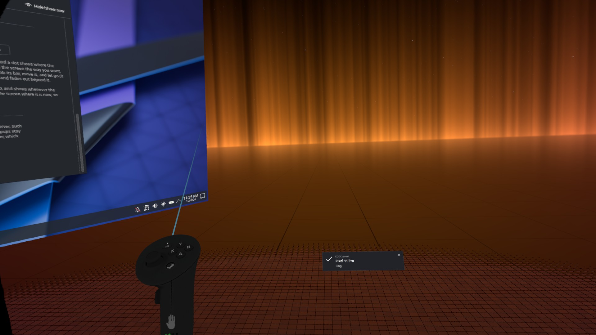

# vr-notify

A notification daemon for SteamVR that displays notifications as clickable panels in VR.

It replaces the (currently broken) SteamVR notification daemon and listens for notifications on the session bus as a normal `org.freedesktop.Notifications` service.



## Usage with Home Manager

```nix
# flake.nix
inputs.steamvr-notifyd = {
  url = "github:utrack/steamvr-notifyd";
  inputs.nixpkgs.follows = "nixpkgs";
};

# Home Manager modules
modules = [ steamvr-notifyd.homeManagerModules.default ];

# configuration
services.steamvr-notifyd = {
  enable = true;
  # args = [ "--width" "0.3" "--right" "12" "--down" "18" ];  # see `vr-notifyd --help`
};
```

The package alone: `nix build github:utrack/steamvr-notifyd`.
